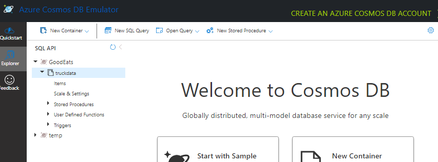
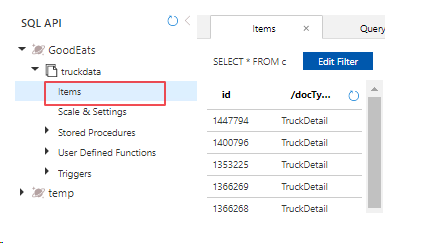

[<BACK](../README.md)

# Query sample data with Cosmos Data Explorer

1) Open the Cosmos Emulator and select the Data Explorer tab


2) Ensure items were crated by selecting the items menu under in the truckdata container fo the GoodEats database. 


3) Click the New SQL Query menu option 


Sample Query with known results to get you started:

```
SELECT *
FROM c
WHERE ST_DISTANCE(c.location, {"type": "Point", "coordinates":[-122.3977267,37.78753989]}) < 30000

```

[<BACK](../README.md)