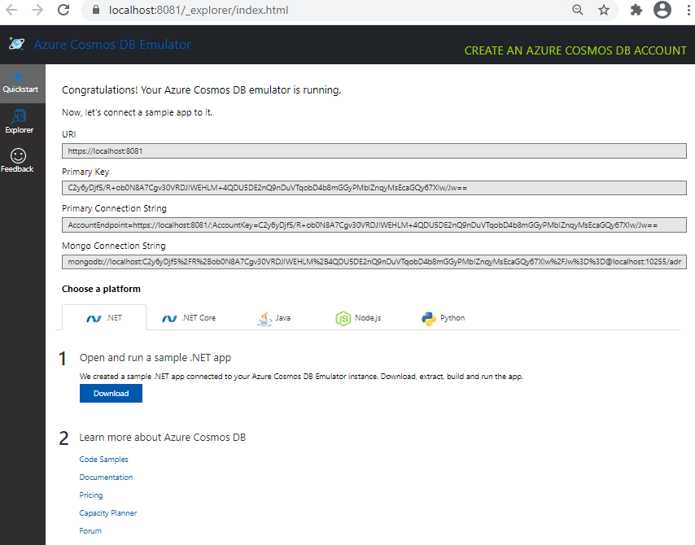

[<BACK](../README.md)

# Loading Sample Data
The GoodEatsCLI utility is published to the tools directory however you will need to add the cosmos configuration settings.  

The following configurations are located int he appsettings.json configuration file.

1) Navigate to the **~/System/Development/Tools/GoodEatsCLI** directory and open the appsettings.json file.


2) Ensure the Azure Cosmos Emulator is running.  When the emulator is started,  a browser window should launch.
3) When the Cosmos Emulator browser window is open, you will find the configurations required to interact with the emulator instance.

Update the app settings file with the following:
```json
{
  "DataConfig": {
    "DataPath": "data/Mobile_Food_Facility_Permit.csv"
  },
  "CosmosConfig": {
    "AccountKey": "Cosmos access key",
    "EndpointUri": "Cosmos endpoint",
    "DbName": "GoodEats",
    "DbContainerName": "foodtrucks"
  }
}

```
using the details below:



4) Open a command window and navigate to the **~/System/Development/Tools/GoodEatsCLI** directory.  
5) Execute the following command 
```
GoodEatsCLI loaddata
```
4) when the process is complete, you will see the following output:


## Next steps
* [Inspect the data](DataExplorer.md)


[<BACK](../README.md)