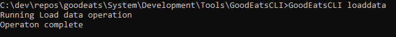

[<BACK](../README.md)

# Loading Sample Data
The GoodEatsCLI utility is published to the tools directory and already configured to work with the default Cosmos Emulator settings.  

The following configurations are located int he appsettings.json configuration file.

```json
{
  "DataConfig": {
    "DataPath": "Path to csv data"
  },
  "CosmosConfig": {
    "AccountKey": "Cosmos access key",
    "EndpointUri": "Cosmos endpoint",
    "DbName": "Cosmos db id",
    "DbContainerName": "Cosmos container id"
  }
}

```

1) Ensure the Azure Cosmos Emulator is running.  When the emulator is started,  a browser window should launch.  
2) Open a command window and navigate to the **~/System/Development/Tools/GoodEatsCLI** directory.  
3) Execute the following command 
```
GoodEatsCLI loaddata
```
4) when the process is complete, you will see the following output:


## Next steps
* [Inspect the data](DataExplorer.md)


[<BACK](../README.md)